<!--
  Terminal profile README  ·  neeldas0032
  Self-hosted animated SVGs — zero third-party stat services.
  Heatmap refreshes daily via .github/workflows/update-profile-art.yml
-->

<h3><code>neel@github ~ $ neofetch</code></h3>

<table>
  <tr>
    <td valign="top"></td>
    <td valign="top"></td>
  </tr>
</table>

 

<h3><code>neel@github ~ $ ps aux | grep neel</code></h3>

 

<h3><code>neel@github ~ $ ./contributions.sh</code></h3>

 

<h3><code>neel@github ~ $ ls -la ~/projects/</code></h3>

 

<h3><code>neel@github ~ $ cat skills.txt</code></h3>

 

<h3><code>neel@github ~ $ ./connect.sh</code></h3>

&nbsp;

&nbsp;

  

